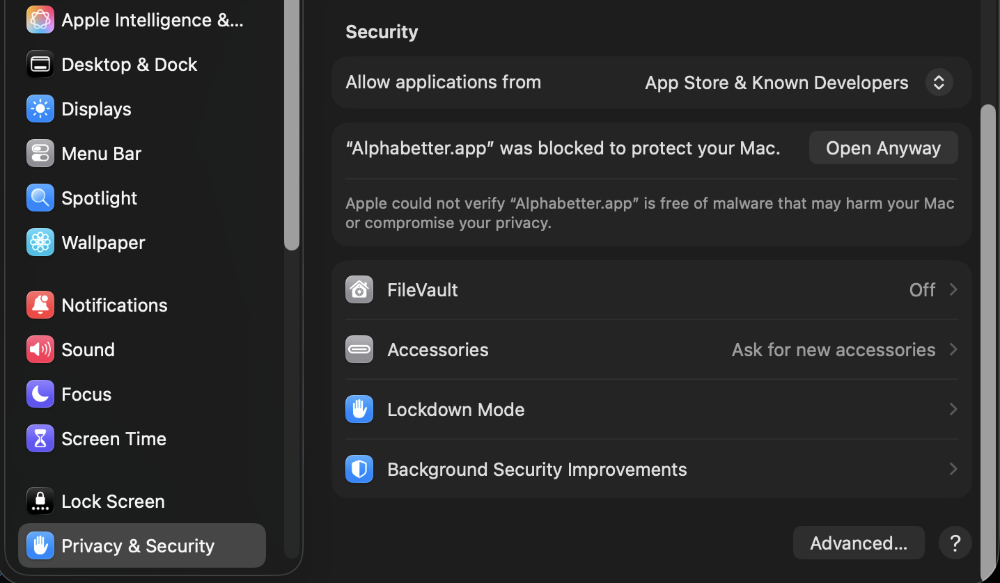
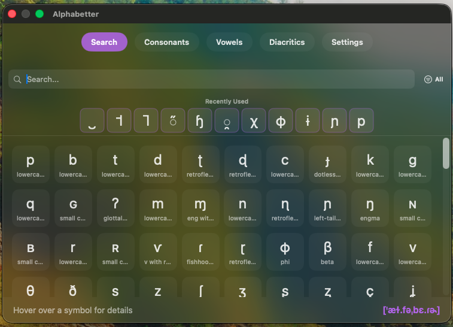
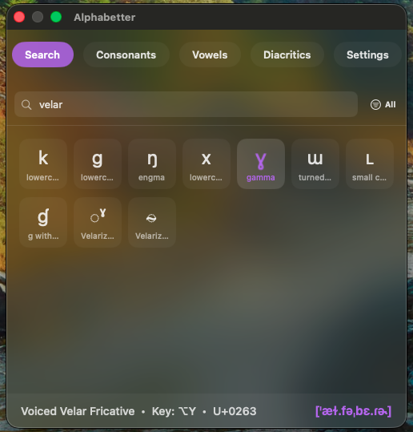
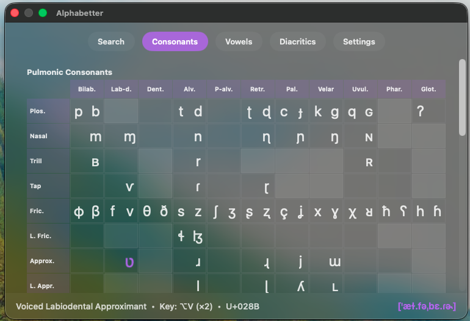
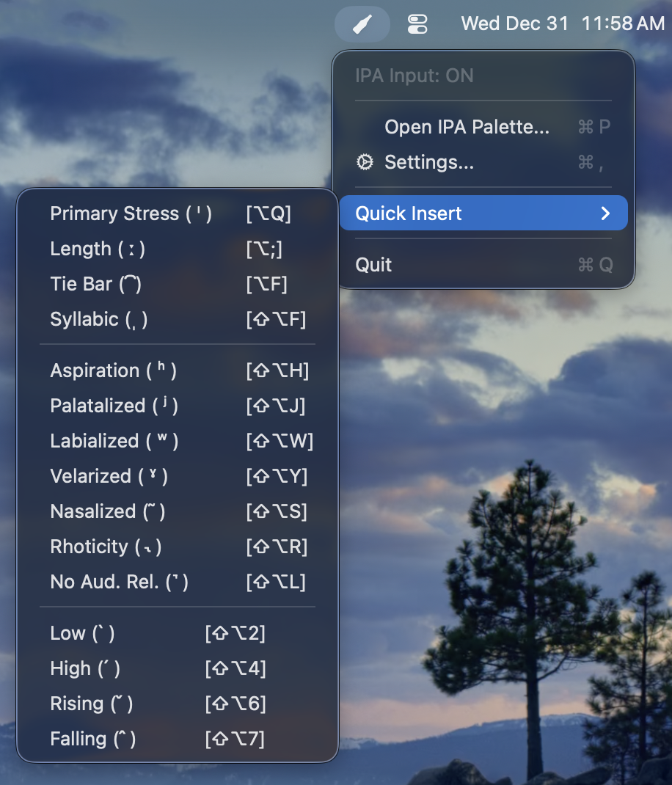

# Alphabetter for macOS
ˈæɫ.fəˌbɛ.ɾɚ ɪz æn æp fɔɹ using the International Phonetic Alphabet. The IPA is accessible via key cycling and a palette. And yes, I actually typed that first bit using my app, and you can too!

## Installation

> **Important:** This app is only supported for macOS 14.2 (Sonoma) and higher (including macOS 26.2 Tahoe). Please update your computer before proceeding with the installation.

1. Download the latest `Alphabetter.zip` from <a href="https://github.com/mikhael2/alphabetter-mac/releases" target="_blank">Releases</a>.
2. If the file appears as `Alphabetter.app`, just open Finder and drag it into your Applications folder. If it downloads as `Alphabetter.zip`, double-click it, then drag the `.app` file into your Applications folder.

### First launch

Because this is a small, non–App Store app, macOS will probably show an “unidentified developer” warning the first time.

1. In Finder, go to **Applications**.
2. Right‑click `Alphabetter.app` and choose **Open**.
3. A warning will pop saying "Alphabetter.app Not Opened: Move to Trash or Done". Click **Done**.
4. Go to your System Settings → Privacy & Security → Security.
5. Next to the dialog "'Alphabetter.app' was blocked to protect your Mac", click **Open Anyway**.
7. In the new dialog that appears, click **Open Anyway**

After this, you can open Alphabetter normally (Dock, Spotlight, Launchpad, etc.).

### Enabling Accessibility

Alphabetter needs Accessibility permission to read keystrokes and type IPA characters.

1. After clicking **Open Anyway**, a dialog box will appear saying "'Alphabetter.app' would like to control this computer using accessibility features."
2. Click **Open System Settings**.
3. Find **Alphabetter.app** in the list and toggle it **On**.  
   - If it’s not there yet, click **+**, choose `Alphabetter.app` from Applications, and add it, then enable it.
4. After granting permission, quit Alphabetter (via the new bottle icon in your menu bar) and relaunch to make sure it picks up the new access. If you don't do this, the keyboard shortcuts won't work. 

> **Privacy:** None of your data is collected, stored, or transmitted. The Accessibility permission is strictly required because macOS treats the "interception" of global keystrokes (to detect the Right Option key) and the automated "typing" of IPA symbols as sensitive system-level actions. This app operates entirely locally on your machine.

### Updating

Check for updates by clicking the menu bar icon (the little IPA bottle 🍾) → Settings → Check for updates.

1. Quit Alphabetter if it’s running.
2. Download the new `Alphabetter.zip` from the **Releases** page.
3. Drag the old `Alphabetter.app` in Applications to the trash; place the new app in the Applications folder. You may need to regrant accessibility permissions.

## Using Alphabetter
Alphabetter lives in your menu bar and stays out of your way until you need it. The app relies on the Right Option key to trigger IPA input.

### 1. Cycle Trigger (Right Option)

To type IPA symbols, simply hold the Right Option key on your keyboard.

- Hold Right Option + Press a Letter: Types the most common IPA variant for that letter.
- Keep Holding Right Option + Press Again: Cycles through other variants.

Example:

- Hold `Right Option` + press `n` → `ŋ` (engma)
- Press `n` again (while holding `Option`) → `ɲ` (palatal nasal)
- Press `n` again → `ɳ` (retroflex nasal)

You can also type common diacritics using `Right Option` + `Shift` + a key. For example, to type an aspirated `pʰ`, you would type `p` then `Right Option` + `Shift` + `h`.

### 2. Special Shortcuts

For speed, some common symbols have dedicated overrides or special cycling rules:

| Shortcut (Hold Rt Option) | Result | Notes |
| :--- | :--- | :--- |
| **Opt + F** | **͡** | Tie bar / Ligature (helpful for affricates) |
| **Opt + Q** | **ˈ** / **ˌ** | Cycles between Primary and Secondary stress |
| **Opt + Semicolon (;)** | **ː** | Length mark |
| **Opt + Period (.)** | **◌̆** | Breve (for short vowels) |

### 3. The Visual Palette

If you can't remember a shortcut or need to search by name, open the palette.

- **Shortcut**: Hold `Right Option` + `Spacebar` (this is customizable in the app settings).

- **Tooltips**: Hover over symbols to see their descriptions, shortcuts (if available), and unicode ID.

- **Search**: Type to filter by feature or name. You can also filter out the noise and just show results for English symbols by clicking `ENG` next to the search bar.

- **Insert**: Click any symbol to type it into your active document.

- **Recents**: The top bar tracks your most recently used symbols for quick access.

- **Tables**: There are also tabs containing tables of IPA symbols in more familiar layouts. Clicking on the symbols in these tables will insert them in your document just like from the search palette.

### 4. Menu Bar "Quick Insert"

Click the Alphabetter menu bar icon (the little IPA bottle 🍾) in your macOS menu bar to see a dropdown for quickly inserting tones and other common diacritics without opening the full window.

### 5. Settings

Access the settings via the meu bar icon (or `Cmd` + `,` while the palette is open).
- Global Shortcut: Change the key used to toggle the visual palette (default is `Spacebar`).
- Check for Updates: Click to check the GitHub for new versions of the app.
- Hide Dock Icon: Check this box to make Alphabetter run exclusively in the menu bar.

#### Support my work!

If you like Alphabetter and want to support me, shoot me an email for my Venmo or Zelle. My email is mikhael2 [at] illinois [dot] edu.

## License & Copyright

**App Logic & Code:**
Copyright © 2025 Mikhael Hayes. All rights reserved.
The source code and software design of this application are proprietary. You may use this app for personal and educational purposes, but redistribution of the app's source code or modified versions of the software logic is not permitted without the author's consent.

**IPA Data & Charts:**
This app includes reproductions of the International Phonetic Alphabet (IPA). The IPA chart and data remain under the Creative Commons Attribution-Sharealike 3.0 Unported License (CC-BY-SA).

*Attribution:*
"IPA Chart, http://www.internationalphoneticassociation.org/content/ipa-chart, available under a Creative Commons Attribution-Sharealike 3.0 Unported License. Copyright © 2015 International Phonetic Association."
